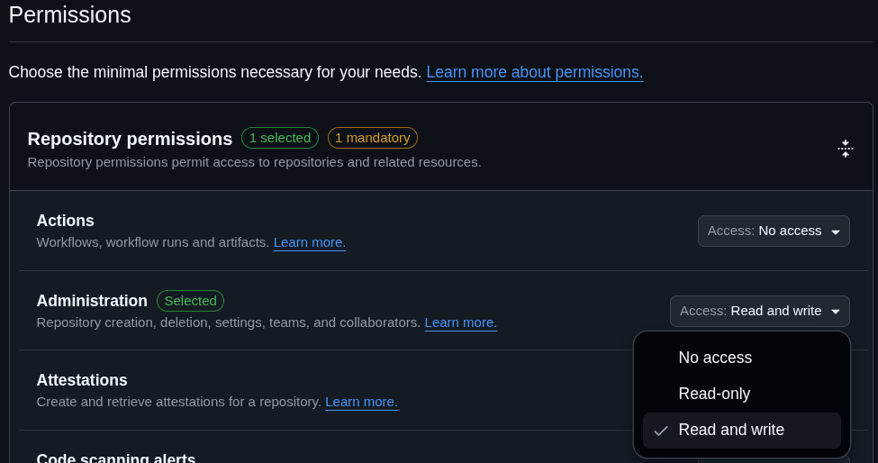
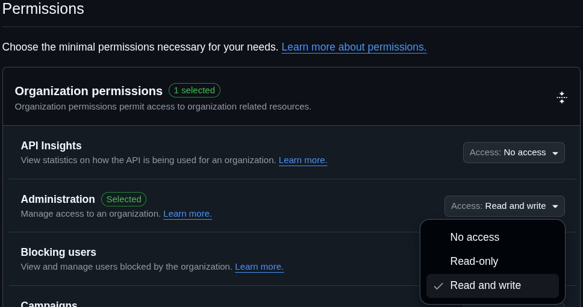
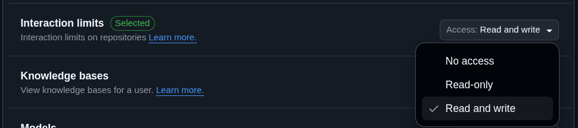

# GitHub Action - Permanent Interaction Limits

This GitHub Action cyclically re-enables temporary interaction limits to make them effectively permanent

You can apply these limits to a repository, an organization, or a user account

## Pre-requisites

### Personal Access Token

To consume this Action you need a GitHub Fine-Grained Personal Access Token (PAT) with the right permission

1. If you use an `"organization"` scope, first you want to disable the expiry of your organization's Personal Access Tokens
	1. Navigate to [your organization's settings](https://github.com/organizations/<ORGANIZATION_NAME>/settings) → [Personal Access Tokens Settings](https://github.com/organizations/<ORGANIZATION_NAME>/settings/personal-access-tokens) → Fine-grained tokens → Set maximum lifetimes for personal access tokens
	2. Disable "Fine-grained personal access tokens must expire"
2. Navigate to [your Fine-Grained Personal Access Tokens](https://github.com/settings/personal-access-tokens) → [Generate new token](https://github.com/settings/personal-access-tokens/new)
3. Fill "name" _(**suggestion**: "`GitHub-Action_Permanent-Interaction-Limits`")_
4. _**Optional**: You can fill "description" with: "`https://github.com/marketplace/actions/permanent-interaction-limits#pre-requisites`" for reference_
5. Select the proper "Resource Owner"
6. Set the expiration to : "No expiration"
7. Select the proper "Repository Access" (at least the ones in which this action is used)
8. About "Permissions", if your `scope` is :
	- **`"repository"`** : "Repository permissions" → "Administration" → Select "Read and write"
	
	- **`"organization"`** : Organization permissions" → "Administration" → Select "Read and write"
	
	- **`"user"`** : Account permissions" → "Interaction limits" → Select "Read and write"
	
9. Copy the generated Personal Access Token _(**note**: it is not possible to read it afterwards)_
10. Navigate to the repository/organization in which you use this action → Settings → Security → Secrets and Variables → Actions → Secrets → Repository/Organization Secrets
11. Name the secret _(**suggestion**: "`TOKEN_GITHUB-ACTION_PERMANENT-INTERACTION-LIMITS`")_
12. Paste the Personal Access Token you previously copied in step 9 in the "Value" field
13. _If you are storing the secret in an organization, make sure to select the proper "Repository access" value_
14. [Provide the Personal Access Token to the action as an environment variable](https://docs.github.com/en/actions/how-tos/security-for-github-actions/security-guides/using-secrets-in-github-actions#using-secrets-in-a-workflow) _(also see examples below)_

## Usage

See the complete [workflow template](./workflow-templates/main.yml)

## Inputs, Variables, and Secrets

| Type   | Name     | Required | Type                                                              | Default Value                      | Description                                                                                                                                                          |
| ------ | -------- | -------- | ----------------------------------------------------------------- | ---------------------------------- | -------------------------------------------------------------------------------------------------------------------------------------------------------------------- |
| secret | `TOKEN`  | `true`   | `string`                                                          |                                    | A GitHub Personal Access Token (PAT) with the required permissions: For repos/orgs: “Administration” (read + write) ; For users: “Interaction limits” (read + write) |
| input  | `target` | `false`  | `"repository" \| "organization" \| "user"`                        | `"repository"`                     | The target entity for applying the interaction limits.                                                                                                               |
| input  | `scope`  | `false`  | `"existing_users" \| "contributors_only" \| "collaborators_only"` | Current interaction limits setting | The scope to apply for the interaction limits.                                                                                                                       |
